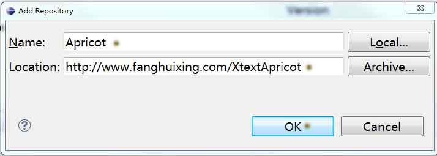
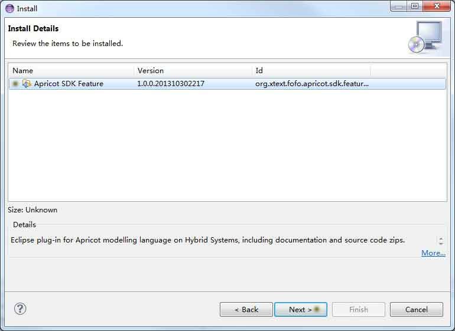
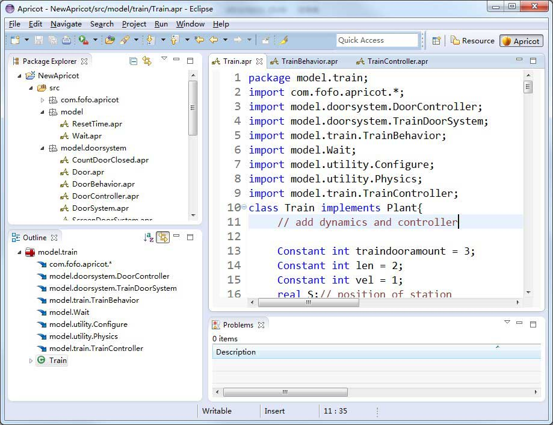

##XtextApricot Update Site for Eclipse##
XtextApricot is an Eclipse plugin for Apricot language, 
you can install the plugin in Eclipse using this URL (as below). 
For more details, see   <a href="#Install the Plugin">'Install the Plugin'</a>.

    http://xtextapricot.apricotresearch.com/

or, you can use this URL:
	
    http://www.fanghuixing.com/XtextApricot/

XtextApricot is developed on <a href="http://www.eclipse.org">Eclipse</a> (Version: Kepler Release,
Build id: 20130614-0229) with <a href="http://www.eclipse.org/Xtext/">Xtext</a> 2.4.3. You can get the source code of XtextApricot from <a href="https://github.com/fanghuixing/XtextApricot/tree/gh-pages/source">here</a>.

----------

# User Guide Contents

1. <a href="#Install the Plugin">Install the Plugin</a>

2. <a href="#Create New Apricot Project">Create New Apricot Project</a>

3. <a href="syntax/main.html">Apricot Syntax</a>

4. <a href="cases/subway/subwaycontrolsystems.html">Case Study -- Modeling Subway Control System in Apricot</a>

----------

 

## <a name="Install the Plugin"> 1. Install the Plugin </a> 

In the 'Help' menu of eclipse, select 'Install New Software...'

The 'Install' window will appear, and click 'Add' to add a new Repository.

Type the name of the repository (we use 'Apricot' here), and the location 'http://www.fanghuixing.com/XtextApricot/' (or 'http://xtextapricot.apricotresearch.com/'), then click 'OK'

*note: if you want to add the repository by an 'Archive', you can download the update file from* 
	
    http://xtextapricot.apricotresearch.com/download/XtextApricot.zip 

*Download XtextApricot.zip, put it in a local folder, and then click 'Archive...' in the 'Add Repository' window, select the zip file you downloaded, and so on.*

You will see the available software, the name and the version information, select  all as the below, and click 'Next':

It will calculate the dependencies and requirements (about 5 minutes), at last, the 'Install Details' would come up, now click 'Next':

Then, accept the license, click 'Finish':

It will install the plugin,

 

If you see a security warning, just click 'OK'.

After the installation, you have to restart Eclipse. 

 

***

## <a name="Create New Apricot Project">2. Create New Apricot Project</a>
At first, select 'File'->'New'->'Project':

Select 'Apricot Project', then click 'Next':

Set the project name, then click 'Finish':

Now, we get the new Apricot project, the interfaces are listed in the package 'com.fofo.apricot', the example model class is in the package 'model'.

---

As follow, the model code view for our subway control system in Eclipse with XtextApricot installed: 

***

    

***

Author: Huixing Fang 

fang.huixing@gmail.com

***
	


