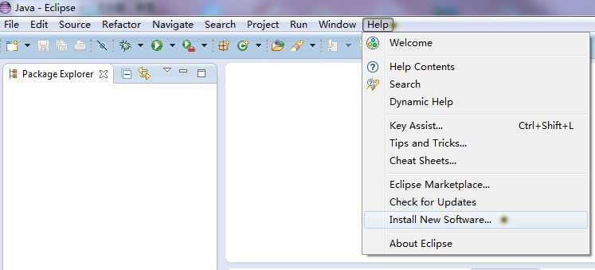
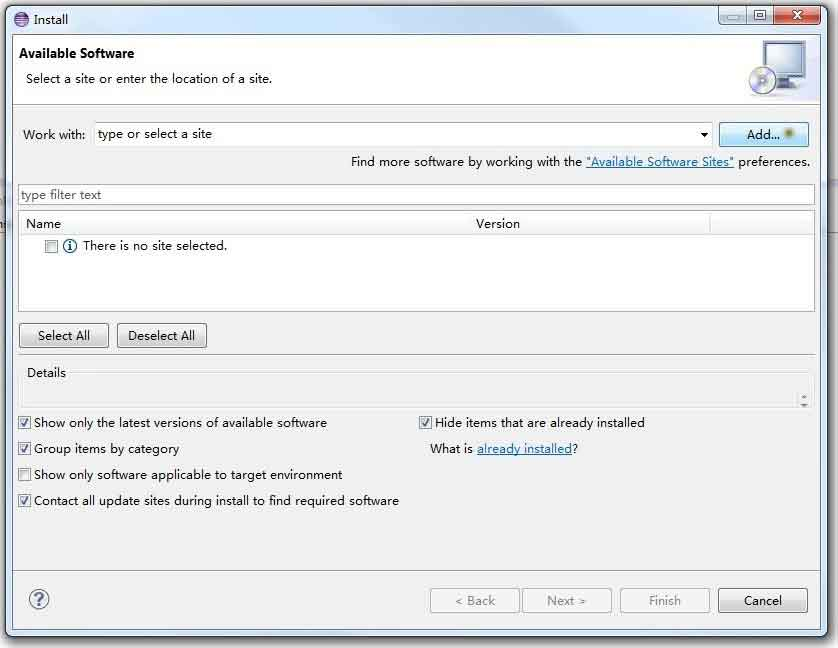

#XtextApricot Update Site#

    http://fanghuixing.github.io/XtextApricot/

---
#Contents#
1. <a href="#Install the Plugin">Install the Plugin</a>

2. <a href="#Create New Apricot Project">Create New Apricot Project</a>

---

## <a name="Install the Plugin"> 1. Install the Plugin </a> ##

In the 'Help' menu of eclipse, select 'Install New Software...'

The 'Install' window will appear, and click 'Add' to add a new Repository.

Type the name of the repository (we use 'Apricot' here), and the location 'http://fanghuixing.github.io/XtextApricot/', then click 'OK'

You will see the available software, the name and the version information, select  all as the below, and click 'next'

It will calculate the dependency and requirement, at last, the 'Install Details' would come up, now click 'Finish'

It will install the plugin,

If you see a security warning, just click 'OK'.

After the installation, you have to restart Eclipse. 

## <a name="Create New Apricot Project">2. Create New Apricot Project</a>##
At first, select 'File'->'New'->'Project':

Select 'Apricot Project', then click 'Next':

Set the project name, then click 'Finish':

Now, we get the new Apricot project, the interfaces are listed in the package 'com.fofo.apricot', the example model class is in the package 'model':



