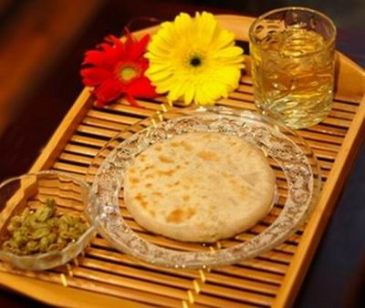
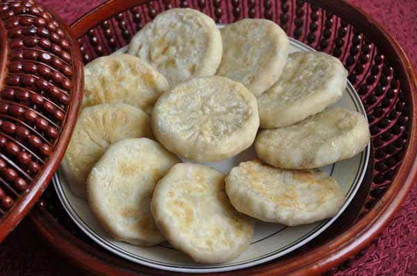

    

 

***

Taguo has long been a traditional food in Huizhou of Anhui province. During the Tang Dynasty (618-907), people in Anhui would bring Taguo with them if they went for an expedition. During the Ming and Qing dynasties (1358-1908), Taguo became the daily necessity for the Anhui people. The food was a favorite for the locals when they were on a business trip, at school or farming. Some people even ate Taguo every day for breakfast.

In the 3rd Road of Laojie Street in the Tunxi district of Huangshan, there is a special snack store that provides Taguo of various types.
Taguo is mainly made of wheat flour, but some are also made of rice flour or corn flour. The flavor of Taguo is decided by the fillings. Ingredients include Chinese toon sprouts, soy beans, flowers of the Chinese scholar tree, and cowpeas, leeks and carrots.


